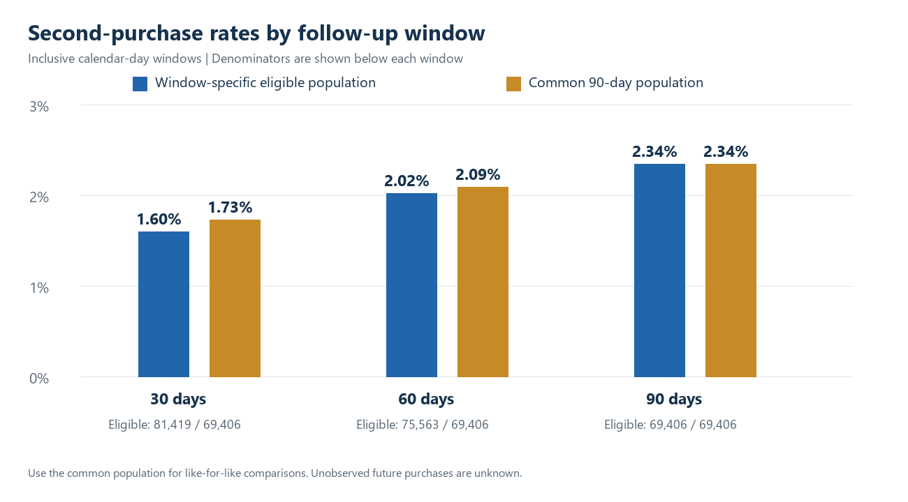

# Customer Segmentation & Repeat Purchase Analytics

A PostgreSQL and Power BI portfolio project using the Olist Brazilian E-Commerce dataset.

**SQL analysis, findings and validation are complete.** The Power BI Project contains a semantic model, DAX and four report pages; native Desktop refresh and visual acceptance remain pending. No Power BI screenshot is claimed.

## What this project demonstrates

- Customer identity resolution across orders using customer_unique_id.
- Separate item/payment aggregation to prevent inflated monetary totals.
- RFM segmentation with consistent handling of tied values.
- Monthly cohort activity with explicit unobservable cells.
- Repeat rates with 30/60/90-day eligibility and a common comparison population.
- Consecutive purchase intervals, same-day sensitivity and observation-window limitations.
- Readable PostgreSQL CTEs/window functions, reconciliation and filter-aware DAX.

## Findings at the July 31, 2018 cutoff

| Measure | Result |
|---|---:|
| Observed customers | 87,214 |
| Eligible delivered orders | 90,127 |
| Merchandise value, excluding freight | BRL 12,382,921.47 |
| Customers with 2+ orders | 3.01% |
| Customers purchasing on 2+ calendar days | 2.12% |
| Second purchase within 90 days, eligible population | 2.34% |
| Median time to second order, observed repurchasers only | 26.01 days |

One-time observed customers are not labeled permanently churned. Observed spend is not predictive lifetime value. Final delivered status makes this a retrospective analysis.

Read the [findings and recommendations](reports/ANALYSIS_FINDINGS.md), [methodology](docs/METHODOLOGY.md), and [executed aggregate evidence](docs/ANALYSIS_RESULTS.json).

## Data and tools

Source: [Brazilian E-Commerce Public Dataset by Olist](https://www.kaggle.com/datasets/olistbr/brazilian-ecommerce), version 2. All nine CSVs are inventoried locally; customers, orders, order items and order payments are used for the analysis. Dataset license: CC BY-NC-SA 4.0; retain attribution and follow the source terms.

Stack: PostgreSQL 18.6, pgAdmin, SQL, Power BI, DAX, Git and GitHub. Reproduction uses PostgreSQL/psql and PowerShell; no Python analysis pipeline is required. One-off independent verification and static-figure rendering used existing local libraries.

## Reproduce

1. Download the source files into data/raw/ and compare hashes with [SOURCE_PROFILE.json](docs/SOURCE_PROFILE.json).
2. Create a dedicated UTF-8 PostgreSQL database, run sql/00_setup.sql, then sql/00_import.psql from the repository root. Import only into empty tables.
3. Run sql/01_data_overview_and_quality.sql.
4. Run scripts/run_analysis.ps1 with your PostgreSQL path, connection and protected passfile.
5. Read the resulting findings/evidence and open [powerbi/Olist.pbip](powerbi/Olist.pbip). Follow the [Power BI guide](powerbi/README.md) for credentials, Refresh and acceptance checks.

The [runbook](docs/RUNBOOK.md) includes commands and local installation details. Passwords, source CSVs and customer-level exports remain outside Git.

## Outputs and navigation

| Location | Contents |
|---|---|
| sql/ | Setup, import, profiling, preparation, RFM, cohorts, repeat, intervals, BI views, validation, exports |
| docs/ | Source/metric definitions, methodology, aggregate evidence and validation |
| reports/ | English evidence-backed analytical findings |
| outputs/figures/ | Reviewed, project-generated static figures from SQL outputs |
| outputs/tables/ | Local exports and inspection helpers; ignored by Git |
| powerbi/ | PBIP entry point, PBIR report, semantic model and DAX |
| scripts/ | Reproduction runner |

- [Data dictionary](docs/DATA_DICTIONARY.md)
- [Source quality and exceptions](docs/DATA_QUALITY_SUMMARY.md)
- [SQL execution guide](sql/README.md)
- [Validation and remaining acceptance checks](docs/VALIDATION.md)
- [Delivery plan/status](docs/PROJECT_PLAN.md)

## Validation and limitations

All 28 SQL invariants passed. An independent CSV implementation matched all 87,214 customer metric/RFM rows, 361 cohort cells, 261,642 repeat-window rows and 2,913 intervals. The Power BI model parsed with the installed Tabular Object Model and its 40 schema-bearing PBIR documents passed Microsoft schema validation. These file checks do not establish native DAX execution, successful refresh or rendered visual correctness.

The cutoff excludes August near the extract boundary; completeness is still an assumption. Sparse 2016 cohorts are excluded from the main cohort grid while their earlier history is retained. Same-day orders materially affect repeat interpretation. Recommendations are testable hypotheses, not causal or profit forecasts.

## Development

Implementation is on dev_v1. Review before merging into main. Do not commit raw data, customer-level exports, credentials, imported Power BI caches, or screenshots supplied in chat.
