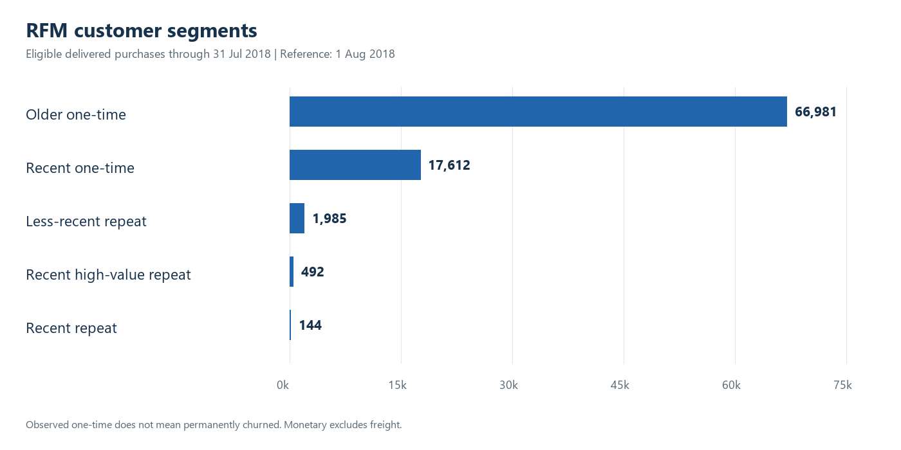
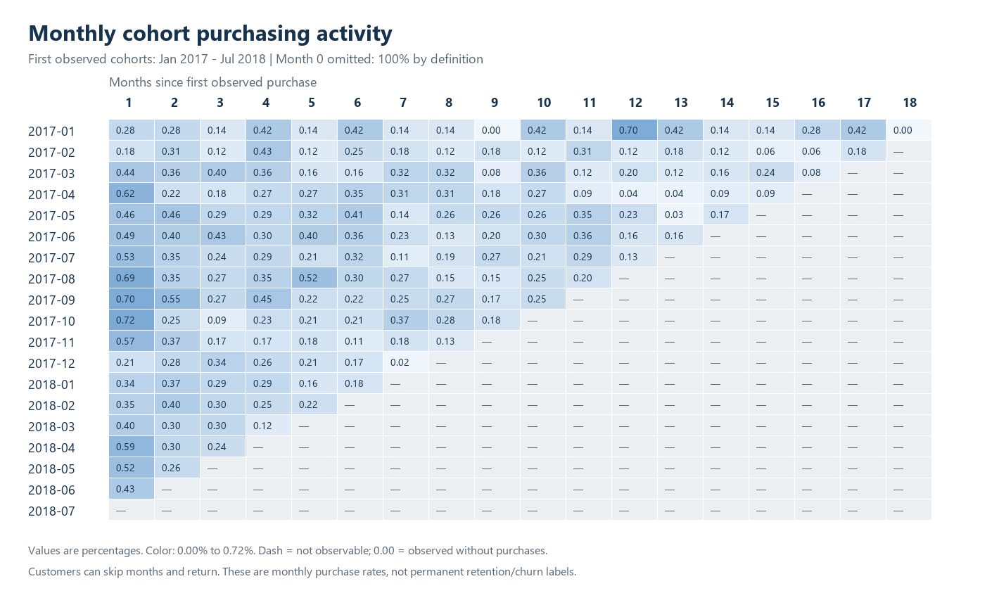
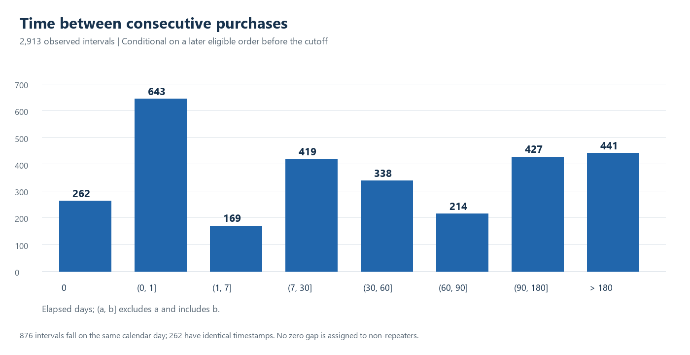

# Customer Segmentation & Repeat Purchase Findings

**The main opportunity is to investigate the second purchase, while distinguishing a new visit from several orders placed together.** Only 3.01% of customers have two or more eligible orders in the observed history. Under the stricter definition of purchasing on different calendar days, the share is 2.12%. These are observed marketplace behaviors, not churn rates.

Scope: delivered purchases from September 4, 2016 through July 31, 2018; RFM reference August 1, 2018. Final recorded status is used retrospectively. See [Methodology](../docs/METHODOLOGY.md) and the exact executed queries in [Analysis results](../docs/ANALYSIS_RESULTS.json).

## Scale and frequency

| Metric | Result |
|---|---:|
| Observed customers | 87,214 |
| Eligible orders | 90,127 |
| Observed merchandise value, excluding freight | BRL 12,382,921.47 |
| One-time observed customers | 84,593 |
| Customers with 2+ orders | 2,621 |
| Purchases per customer | 1.0334 |
| Repeat customer share of observed merchandise value | 5.49% |

A customer with one recorded order may buy again after the cutoff or through an unobserved channel. The extract cannot establish permanent churn or lifetime value. The merchandise measure also excludes freight, costs and returns accounting.

## RFM: descriptive customer groups

| Segment | Customers | Merchandise value (BRL) |
|---|---:|---:|
| Older one-time | 66,981 | 9,184,024.74 |
| Recent one-time | 17,612 | 2,519,507.34 |
| Less-recent repeat | 1,985 | 503,575.57 |
| Recent high-value repeat | 492 | 165,059.89 |
| Recent repeat | 144 | 10,753.93 |

The 17,612 recent one-time customers are a potential second-purchase research population. The 492 recent high-value repeat customers are a smaller group for studying what accompanies repeat behavior. Their higher observed spend is partly built into the segment definition, so it does not prove that targeting them causes higher revenue.

Most customers share Frequency = 1. Splitting those ties into arbitrary equal-sized frequency buckets would manufacture differences; the implemented scores preserve tied values.

## Repeat rates with comparable follow-up

| Window | Eligible customers | Second purchases in window | Window-specific rate | Common-population rate |
|---|---:|---:|---:|---:|
| 30 days | 81,419 | 1,300 | 1.60% | 1.73% |
| 60 days | 75,563 | 1,526 | 2.02% | 2.09% |
| 90 days | 69,406 | 1,627 | 2.34% | 2.34% |

The common population has 69,406 customers with at least 90 days of observed follow-up. Use its 1.73% / 2.09% / 2.34% sequence for a same-population comparison. In the 90-day population, 67,779 customers have no observed second purchase within 90 days; that does not mean they never return.

The observed whole-history rate of 3.01% is a different metric and should not be compared with these windows as if all customers had equal exposure.

## Cohorts: monthly purchasing is intermittent

Across cohorts eligible for month 1, 389 of 81,001 customers purchased in the next calendar month: **0.48%**. This is purchasing activity, not continuous retention, and month 0 is a definition-based 100%.

The main grid uses January 2017-July 2018 cohorts and retains unobservable periods as blanks. Sparse 2016 history remains in first-purchase identification. The 0.48% month-1 activity rate differs from a 30-day repeat rate: the former follows calendar months and excludes within-month repeats, while the latter follows each customer's first-purchase date.

## Timing: a wide, conditional distribution

Among 2,621 customers with an observed second order, the median first-to-second interval is **26.01 days**, the 75th percentile is **119.23 days**, and the 90th percentile is **235.79 days**. The mean is 76.34 days, illustrating the long right tail.

All 2,913 consecutive intervals have a median of 27.55 days. Of these, **876 are within the same calendar day**, including **262 at the exact same timestamp**. There are 775 repeat-order customers whose observed purchases all occur on one date. Marketplace order splitting or same-session behavior is a hypothesis; these tables do not establish the cause.

These intervals condition on observed repurchasers and truncate long waits at the cutoff. The median is not a validated best time to send a campaign, and single-order customers must not receive a zero-day interval.

## Cutoff sensitivity

| Purchase cutoff | Customers | Orders | Observed repeat rate |
|---|---:|---:|---:|
| 2018-06-30 | 81,265 | 83,968 | 2.99% |
| 2018-07-31 | 87,214 | 90,127 | 3.01% |
| 2018-08-31 | 93,358 | 96,478 | 3.00% |

The aggregate observed repeat rate is similar across these candidate cutoffs. That does not prove recent cohort completeness or stable fixed-window rates. July is the primary full-month reporting cutoff; August remains a sensitivity view near the extract boundary. Final delivered status still introduces retrospective knowledge.

## Source exceptions retained

The eligible population includes 1 order without a payment row, 8 without a delivery timestamp and 14 without an approval timestamp. There are 273 matched orders with an absolute payment versus merchandise-plus-freight difference above BRL 0.01. Merchandise-based eligibility retains these orders and exposes flags; mismatch causes are not assumed.

## Recommendations to test

| Proposed action | Evidence and intended audience | Validation needed |
|---|---|---|
| Investigate second-purchase barriers | 84,593 one-time observed customers; low mature-window repeat rates | Add browsing, category and CRM evidence; avoid labeling nonbuyers as permanently churned |
| Test a post-purchase follow-up | 17,612 recent one-time customers provide a descriptive research pool | Randomized holdout, delivery-aware timing, margin/unsubscribe guardrails and equal follow-up |
| Examine same-day multi-order behavior | 876 same-day intervals; later-day repeat share falls to 2.12% | Order/session/channel linkage before interpreting those orders as new customer visits |
| Learn from recent repeat customers | 492 recent high-value repeat and 144 other recent repeat customers | Compare relevant prior attributes; segment definitions alone cannot establish causal drivers |
| Monitor mature cohort windows | Different denominators and incomplete periods materially change interpretation | Show eligible counts, blank unobservable cells, and preserve first-purchase history |

No uplift, profit forecast, or optimized campaign threshold is claimed. The next evidence needed for causal retention recommendations is an intervention with an appropriate comparison group.

## Verification and deliverables

SQL invariants: 28 passed. Independent CSV recomputation matched all 87,214 customer metrics/RFM scores, 361 cohort cells, 261,642 repeat-window rows and 2,913 interval rows. See [Validation](../docs/VALIDATION.md) and [independent evidence](../docs/INDEPENDENT_VALIDATION.json).

[Power BI project](../powerbi/README.md) contains the semantic model, measures and four report pages. File/schema checks do not substitute for Desktop refresh and visual acceptance; that limitation is recorded separately.
